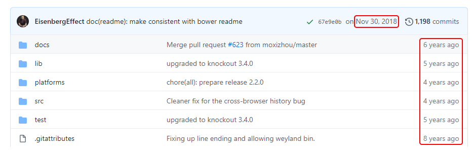
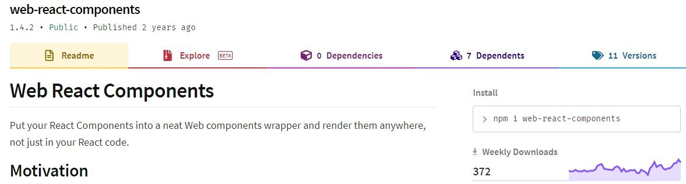

One of the client projects that I work on makes use of Durandal and KnockoutJS for their front end. This approach is quite old, so old that Durandal's Github repository has not received significant updates in several years and has even been archived. 

This presents the dev team with quite a few issues;

- Old packages are picked up as vulnerabilities in Third Party scans. (Which is completely justified)
- This is a security issue, since we cannot easily get fixes for issues picked up by third party security scans by simply updating our framework. 
- Any issues in the framework will need to be fixed by us (the dev team), either by finding a work around or by installing more unmaintained packages.
- It is a lot harder to search for solutions to issues encountered on a framework that hasn't had a release in 5 years.
- It takes more developer effort to build features using these tools.

We also have a few additional problems thanks to our setup (which is slightly more technical);
- Our Javascript minification depends on a outdated Gulp task that cannot handle ES6 syntax. 
- The Gulp version used is extremely old, many fruitless hours have been spent trying to rip it out and replace it with something more modern.
- We are locked in to using old Node versions (<= v10) due to our Gulp version and the dependencies of our build setup.

This problem has been building for years, every day that goes by where we are not migrating to a new framework we are making it more difficult to migrate in the future. The product that we are building is used by quite a few paying users and our client cannot afford the downtime that may come as a result of a rewrite. The client also has several competitors and cannot afford to slow down on feature development and fall behind. The system is also very complex at this point, with a lot of hidden business logic scattered throughout the app as different features were bolted on. With all of this we needed to find a solution that met the following criteria;
- The ability to replace parts of the webapp slowly over time. Which means whatever we choose must play nicely with Durandal.
- A framework/tool that is both modern and will be around long enough for us to make the eventual transition.
- A framework/tool that our team has some experience with, so that we can pick it up quickly and not need to rewrite a lot of the new framework code once the migration is complete.
- 
Our solution? 

## React and WebComponents! 🎉

React is a super popular User Interface Component library (yes not a framework) developed by Facebook and is used by millions of developers world wide. It also has a majority share of the front-end Javascript library market. So this is a modern tool that has a lot of developer support and documentation. It should also be around for quite a while, since it's not a Google product (Oooh feel the burn Google!). There are also a lot of people using React which means that there are a lot of potential developers that will keep it alive if the React team abandons the project. 

WebComponents allows us to create custom and reusable HTML tags to contain complex controls and components. While I will admit WebComponents has not done as well as many Javascript Frameworks, it's not a dead solution, not yet 😅. WebComponents loose out on the nice developer tools that React, Angular and Vue provide which allow developers to create custom reusable components. But in this situation we are not relying on the WebComponents developer tools, we are simply using it to wrap our React components.

## Why WebComponents?

Custom components created by either React, Angular, Vue, etc are only really usable in solutions that use the framework/tool's the components were built with. This is where WebComponents shine in our solution. By wrapping our React components as WebComponents, we can register them as html tags (e.g. `dashboard-charts`) and then use them directly from our Durandal app in the HTML files as (e.g. `<dashboard-charts></dashboard-charts>`) with the added ability to pass properties down with Knockout's bindings (e.g. `data-bind="attr: { id: localId}"`). This way we can "inject" our React components into our Durandal front-end and pass data down to the components. This makes migrating a single component at a time possible!

### The downsides

This isn't a perfect solution unfortunately. It is an uncommon way to make use of React and we have found some situations where we needed to use the React Life Cycle hooks in a suboptimal way. The props that are passed down to the React components are serialised, therefore we cannot pass functions to the React components. The performance of rendering multiple individual React components on the page, each with their own virtual DOM is probably not fantastic, although we have not seen a significant decrease.

This approach is not used by very few developers (if any, I have not come across anyone else that has taken this approach), so we are still on our own when it comes to fixing framework bugs. The package we depend on to wrap the React components as WebComponents is old and not used very often. 

However, the more the webapp becomes "Reactified" the more all of these issues are resolve and some will even resolve themselves. We can use the React Life Cycles better when not accommodating the way Durandal binds data, the performance will improve as less React components are rendered individually rendered on the page as separate apps and finally we can move away from (directly) depending on outdated packages

_Side note: For the communication between React and Durandal we have found that the best solution was to make use of window events. This allows us to listen to and dispatch events on either the React or Durandal side allowing for 2 way communication. This will also be removed over time as React takes over our front-end._

### Unexpected upsides

One of the unexpected upside is that our components are very modular, they have to be in order to be called directly from HTML with minimal props. We took advantage of this and use Storybook to both test and check our components before running the whole back-end solution and testing our components within the Durandal app.

This setup also allows us to keep the React front-end separate from our back-end solution which the Durandal app is very tightly coupled with. We are finally able to deploy front-end changes separately from the back-end code. Meaning that we can have smaller, faster and less risky releases to production.

## Would I suggest you take this approach?

Not unless you have to 😅. This solution will never beat a front-end application built with your favourite framework/tool. This solution is only intended to get us away from a dying framework as gently as possible and keeping the interests of our client in mind. No clients want to hear that time needs to be spent on a rewrite, it almost never adds value to their business. But having a dead framework running on their webapp and spending days building simple features that their competitors can do in hours does hurt. The longer we take to migrate, the more likely we are to get stuck with either situation and at the worst both a rewrite and slow development.